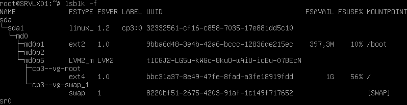

# Exercice 2 - Manipulations pratiques sur VM Linux

## Partie 1 - Gestion des utilisateurs

**Q2.1.1**

Connecté en root, lancer la commande :

```bash
adduser perso
```

Entrer un mot de passe, et les informations de l'utilisateur.

**Q2.1.2**

Il peut être intéressant d'ajouter l'utilisateur au groupe sudo :

```bash
usermod -aG sudo perso
```

## Partie 2 - Configuration de SSH

**Q2.2.1 à 2.2.3**

Modifier le fichier de configuration ssh :

```bash
nano /etc/ssh/sshd_config
```

Avec les lignes suivantes :

```bash
PermitRootLogin no
AllowUsers perso
PubkeyAuthentication yes
PasswordAuthentication no
```

## Partie 3 - Analyse du stockage

**Q2.3.1**



**Q2.3.2**

Ext2, Ext4, Swap.

**Q2.3.3**

**Q2.3.4**

**Q2.3.5**

## Partie 4 - Sauvegardes

**Q2.4.1**

* bareos-dir : contrôle le système de sauvegarde
* bareos-sd : stocke à la demande de bareos-dir sur les volumes de sauvegarde
* bareos-fd : sert à lire et vérifier les fichiers à sauvegarder

## Partie 5 - Filtrage et analyse réseau

**Q2.5.1**


**Q2.5.2**

Autorise les connexions internes (loopback) SSH (TCP port 22), l'IPv4 et IPv6.

**Q2.5.3**

Tout le reste est interdit.

**Q2.5.4**

```bash
nft add rule inet inet_filter_table in_chain tcp dport { 9101, 9102, 9103 } accept
```

## Partie 6 - Analyse de logs

