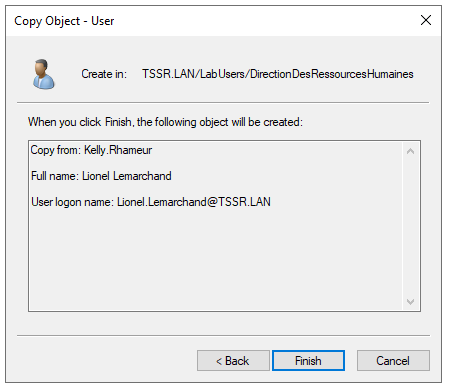
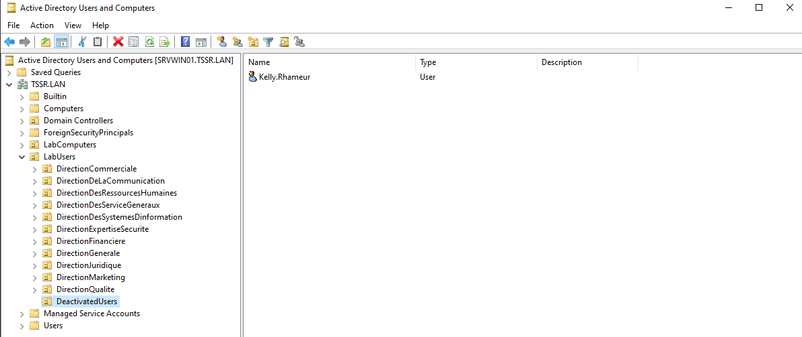
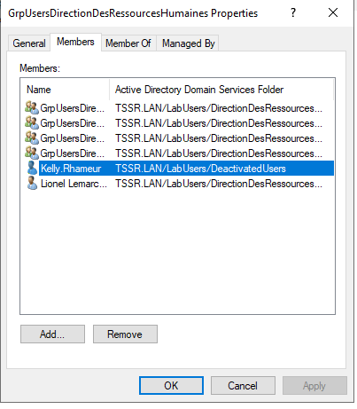
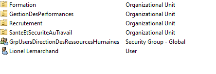

# Checkpoint3

**mdp windows:** %Adm!n@2k=T0p

## Exercice 1

### Partie 1

**Q1.1.1** 

**Q1.1.2** 

**Q1.1.3** 

**Q1.1.4** 

### Partie 2

### Partie 3

## Exercice 2

Lorem

## Exercice 3

Lorem